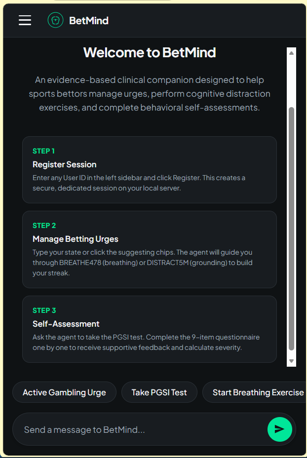
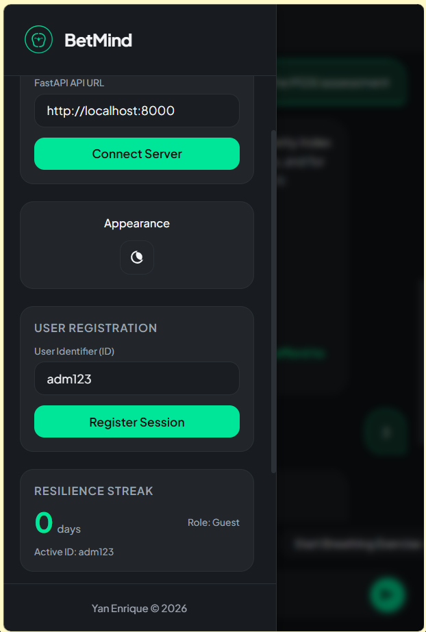
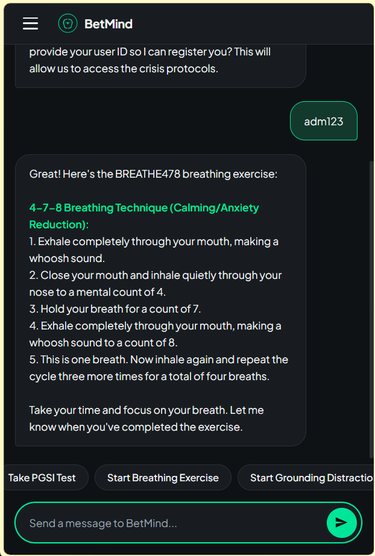
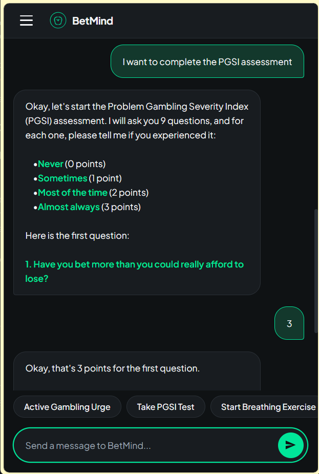
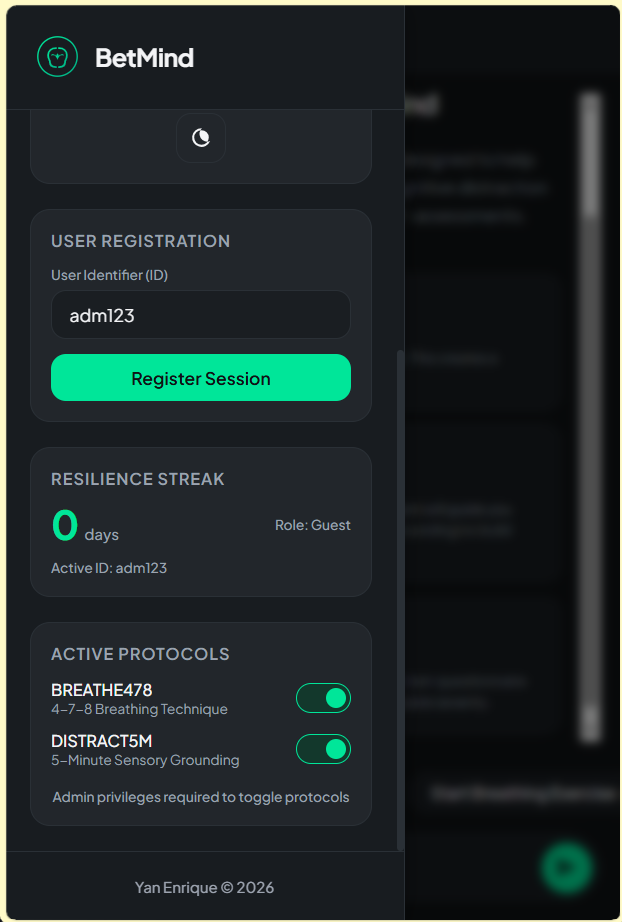

# BetMind

<p align="center">
  
</p>

<p align="center">
  <b>An Evidence-Based AI Agent and Minimalist Client for Sports Betting Harm Reduction and Cognitive Urge Management.</b>
</p>

<p align="center">
  <a href="README_PTBR.md">Leia este README em Português</a>
</p>

---

Developed by [Yan Enrique](https://github.com/OYanEnrique) as the Capstone Project for the **AI Agents: Intensive Vibe Coding Capstone Project** on Kaggle, under the **Agents for Good** category.

---

## Project Vision & Story

Sports betting has transitioned from a physical activity to an instant, highly gamified digital experience. With the rise of mobile sportsbooks, a bettor can place a wager in seconds, often driven by cognitive distortions or acute emotional impulses. During these critical windows of vulnerability (gambling urges), typical interventions like helpline numbers or static support articles are passive and fail to engage the user.

BetMind was conceived to address this gap as an active, compassionate, and clinically informed digital gatekeeper. Rather than acting as a static form, BetMind is a conversational partner that guides the user through crisis moments in real time. It balances the conversational versatility of Large Language Models with programmatically enforced clinical guardrails to deliver a safe, secure, and structured environment for behavioral harm reduction.

<p align="center">
  
  
  
  
  
</p>

---

## Capstone Competition Context

This project was built during the **5-Day AI Agents: Intensive Vibe Coding Course With Google** on Kaggle and submitted as part of the official capstone registry:
- **Course Page**: [5-Day AI Agents Course Overview](https://www.kaggle.com/competitions/5-day-ai-agents-intensive-vibecoding-course-with-google/overview)
- **Capstone Project Page**: [Kaggle Capstone Project Registry](https://www.kaggle.com/competitions/vibecoding-agents-capstone-project)
- **Track/Category**: Agents for Good
- **Project Demo Video**: [Watch on YouTube](https://youtube.com/shorts/k3bExS9c2w4)

---

## System Capabilities

BetMind integrates five core modules:

1. **Urge Intervention Guiding**: Active, empathetic crisis management when users experience active urges to bet.
2. **Cognitive Distraction Techniques**: Direct access to guided breathing protocols (BREATHE478) and sensory grounding exercises (DISTRACT5M) to redirect the user's attention.
3. **Problem Gambling Severity Index (PGSI) Assessment**: A conversational implementation of the standard 9-item PGSI questionnaire. The agent administers the questions one by one, calculates the final score, determines the severity tier (Non-problem, Low, Moderate, or Problem Gambler), and provides supportive, non-judgmental clinical feedback.
4. **Resilience Streak**: A habit-building tracker where users build a consecutive interaction days streak after programmatically confirming the completion of an exercise.
5. **Administrative Console**: An interface that permits system administrators to enable or disable specific crisis protocols in real time.

---

## Technical Architecture & Security Guardrails

BetMind is engineered with a strict division of concerns using a client-server architecture:

```
[ Frontend: HTML5/CSS3/JS ]  <---(REST / SSE)--->  [ Backend: FastAPI Server ]
- Material Design 3 UI                              - Google ADK Agent
- Dark/Light Theme toggles                          - Gemini 2.5 Flash Model
- Concentric Mind-Focus SVG                         - Session Database
- State Polling Loop                                - Local Python Tools
```

### 1. The Backend (Google ADK & FastAPI)
- **Google Agent Development Kit (ADK)**: Used to define the agent, system instructions, and tool bindings.
- **Model**: `gemini-2.5-flash` acts as the cognitive engine, generating responses and invoking tool calls.
- **Programmatic Security boundaries**:
  - **Registration Wall**: Users must register a User ID in the session state before the `retrieve_intervention_exercise` tool permits access to exercises.
  - **Protocol Toggles**: Only users with the `"admin"` role are authorized to modify protocol statuses via `update_protocol_status`.
  - **Deactivation Enforcement**: The `retrieve_intervention_exercise` tool checks the session database and blocks any disabled protocols, returning a structured error message to the agent.
  - **Audit Logging**: Successful interventions trigger the `process_session_resolution` tool, which saves session metadata to the local audit log and locks the session state.

### 2. The Frontend (Material Design 3 Expressive)
- **Minimalist Aesthetic**: Styled to fit exactly in the browser viewport (`100dvh`), removing unnecessary clutter to keep the user focused.
- **Calming Color Theme (Slate & Mint)**: Dark mode (charcoal background with mint green accents) and light mode (soothing slate gray) options to lower cognitive strain.
- **Connection Diagnostics**: Implements a diagnostics system using `no-cors` pre-checks to verify the server status.
- **SSE Stream Decoder**: Reads the Server-Sent Events (SSE) stream chunk-by-chunk, accumulating partial data to display responses incrementally and overriding with the final payload to prevent repetition bugs.
- **Session Syncing**: Polls the backend database after every turn to synchronize the streak and active protocols.

---

## Local Setup & Execution Instructions

To run the BetMind backend and frontend servers locally on your machine, follow these steps:

### Prerequisites
- Python 3.12 or higher.
- [Astral uv](https://github.com/astral-sh/uv) (Python package manager).
- A valid Gemini API Key from Google AI Studio.

### Step 1: Configure Backend Environment
1. Navigate into the `betmind` subfolder:
   ```bash
   cd betmind
   ```
2. Create a `.env` file inside the `betmind` folder and add your Gemini API Key:
   ```env
   GEMINI_API_KEY="your-gemini-api-key-here"
   ```

### Step 2: Start the Backend Server
Start the FastAPI server on port 8000. On Windows (PowerShell), enable CORS origin allowance to accept incoming connections from the local frontend:
```powershell
$env:ALLOW_ORIGINS="*"
uv run uvicorn app.fast_api_app:app --host 127.0.0.1 --port 8000
```
Verify the server is running by accessing `http://127.0.0.1:8000/health` in your browser.

### Step 3: Start the Frontend Server
Open a new terminal window in the root directory of the project (`c:\Users\Yan Enrique\Documents\betmind`) and serve the static files:
```bash
python -m http.server 3000
```
Open your web browser and go to `http://localhost:3000` to interact with the application.

<div align="center">

<br>

**Project Author:** [Yan Enrique (OYanEnrique)](https://github.com/OYanEnrique)  
*(Data Scientist | Machine Learning Engineer)*

</div>

---

## License

This project is licensed under the Apache License 2.0.

```
Copyright 2026 Yan Enrique

Licensed under the Apache License, Version 2.0 (the "License");
you may not use this file except in compliance with the License.
You may obtain a copy of the License at

    http://www.apache.org/licenses/LICENSE-2.0

Unless required by applicable law or agreed to in writing, software
distributed under the License is distributed on an "AS IS" BASIS,
WITHOUT WARRANTIES OR CONDITIONS OF ANY KIND, either express or implied.
See the License for the specific language governing permissions and
limitations under the License.
```
