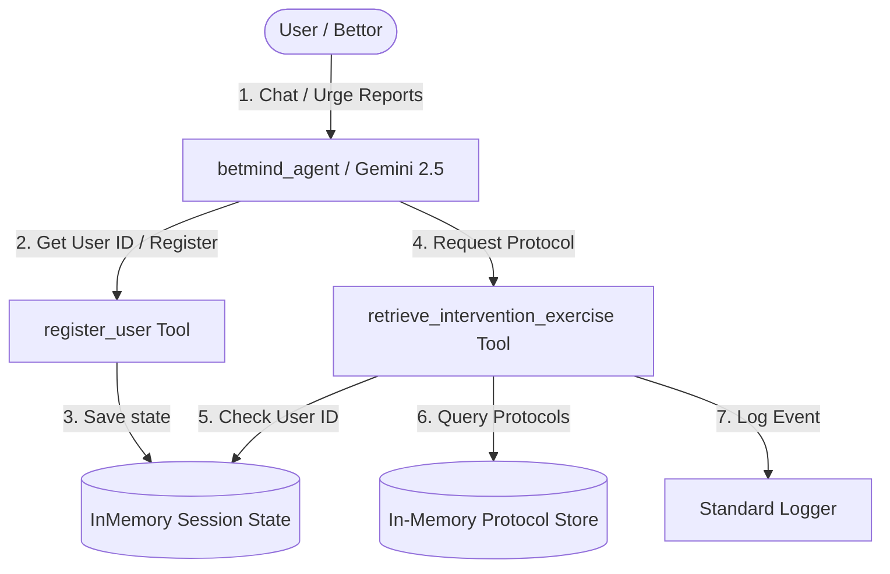

# STRIDE Threat Model Assessment - `betmind` Agent

This document presents a systematic threat model assessment of the `betmind` AI agent architecture and codebase, following the STRIDE methodology.

---

## 1. System Boundaries & Data Flow

### Boundary Components
* **User Input**: Text messages submitted by the sports bettor via chat.
* **Agent Core**: LlmAgent (`betmind_agent` running on `gemini-2.5-flash`) executing logic based on system instructions.
* **Custom Tools**: `register_user` and `retrieve_intervention_exercise` executing local Python functions.
* **Session Storage**: In-memory dictionary accessed via `tool_context.state` (transient).
* **Protocol Store**: In-memory dictionary containing crisis interventions (`BREATHE478`, `DISTRACT5M`).

---

## 2. STRIDE Threat Assessment

### 1. Spoofing (Identity Theft)
* **Threat**: A user spoofing another user's identity to access personalized states or fake crisis intervention access logs.
* **Assessment**:
  - The `register_user` tool accepts any arbitrary string as a `user_id` without verifying it against an identity provider (e.g., Auth0, OAuth, database checks).
  - There is no signature verification or authentication layer to prove a user owns the ID they register.
* **Mitigation Priority**: **Medium**
* **Recommendation**: Integrate token-based authentication (JWT) and extract the user identity from authenticated headers rather than trusting arbitrary user-supplied arguments.

### 2. Tampering (Data Manipulation)
* **Threat**: Manipulation of the session state or parameter injection when calling tools.
* **Assessment**:
  - Session state is stored in memory using the prototype default (`InMemorySessionService`). If run in a multi-tenant environment without isolated session IDs, session hijacking could occur.
  - The `retrieve_intervention_exercise` inputs are normalized but not validated using strict Pydantic schemas, leaving it open to unvalidated dictionary key lookups.
* **Mitigation Priority**: **High**
* **Recommendation**: Follow our Secure Coding Standard (from `CONTEXT.md`) and validate all tool inputs using strict Pydantic schemas. Use cryptographically secure, random session IDs.

### 3. Repudiation (Denial of Actions)
* **Threat**: A user accessing critical protocols or modifying state without an audit trail, or logs being cleared/tampered with.
* **Assessment**:
  - Accesses are logged using standard Python `logging` to stdout/console.
  - While this provides a basic audit trail, there is no persistent, tamper-resistant centralized log database.
* **Mitigation Priority**: **Low**
* **Recommendation**: Route log outputs to a secure cloud-based logging service (like GCP Cloud Logging) with immutable write policies.

### 4. Information Disclosure (Data Leakage)
* **Threat**: Leakage of the Gemini API key or sensitive user details in error logs.
* **Assessment**:
  - **High Risk**: The Gemini model is initialized in `app/agent.py` with a hardcoded mock API key: `api_key="AIzaSyD-mock-key-value-12345"`.
  - While this mock key was explicitly introduced to test pre-commit security gates, having it in source code represents a threat if replaced by a production key.
  - Raw exception tracebacks are not caught and could leak directory paths or system architecture details.
* **Mitigation Priority**: **Critical**
* **Recommendation**: Keep the Semgrep pre-commit hook active to ensure keys are never committed. In production, load the API key from environment variables (`GOOGLE_API_KEY`) or GCP Secret Manager.

### 5. Denial of Service (DoS)
* **Threat**: Exhausting Gemini API quotas or application memory via spam requests.
* **Assessment**:
  - No rate-limiting is implemented in `fast_api_app.py`.
  - An attacker could spam requests to trigger many LLM calls, causing high financial costs or quota exhaustion.
* **Mitigation Priority**: **Medium**
* **Recommendation**: Implement rate-limiting middleware (e.g., slowapi) at the FastAPI level, and configure token limits (`max_output_tokens`) on model generation configs.

### 6. Elevation of Privilege (Access Bypass)
* **Threat**: An unauthenticated user bypassing registration to retrieve crisis intervention protocols.
* **Assessment**:
  - The `retrieve_intervention_exercise` tool checks for the presence of `user_id` in `tool_context.state`.
  - While this prevents accidental unauthenticated access, the "privilege" check is easily bypassed because any user can self-register any ID via `register_user` without verification.
* **Mitigation Priority**: **High**
* **Recommendation**: Implement server-side verification of session access rights before invoking sensitive tool actions.
